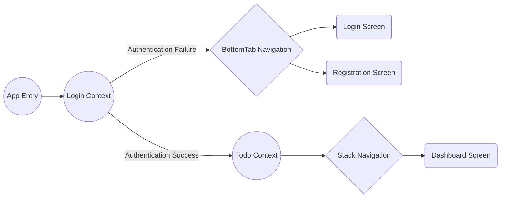

# Todo List App

Hi All, 
Have created the Todo list app which contains the following pages:

 1. Login Screen
 2. Registration Screen
 3. Dashboard

***Learned Here:*** 

 1. Screen Design.
 2. Flex-Box
 3. Stylesheet
 4. Auth Flow using context
 5. State -- Props
 6. Async storage (insert, delete)
 7. Session handling (Once login, don't need to login again)

Flow of App
 - 

# SCREEN EXPLANATION

## 1. LOGIN SCREEN

 - Bottom tab used to navigate between the login and registration screen.
 - First text field used for user name and second for password.
 - On password eye icon used to change text visibility of the password.
 - Reset button reseting the both the text field and password visibilty (default is non visible).
 - If user didn't enter proper value, then it will throw error and display below the bottom of the respective text field.
 - Accurate credentials is: Username: **Admin** and Password: **PASSWORD**. If user use any other credentials, then it will throw error and display in the screen.

## 2. REGISTRATION SCREEN

 - Four text field are for User Name, Password, Email, Phone No.
 - Password field contain eye icon, which control the visibility of the text of password text field.
 - Reset button used for reseting the state of the all text field and the visibility of the password.
 - If user click the sign up button without entering the proper value, then it will display error message bottom of the respective text field.

## 3. DASHBOARD SCREEN

 - Clicking on the top plus icon text entry field will appear, then anybody can enter the desired text over there.
 - Clicking on the reset button it will reset the text input to blank.
 - Clicking on the save button, it will appear on the list. And it stays till logout. Even if user close the app(not logged out), then also after relaunch it will display.
 - Every to do item contain a delete icon, clicking on that it simply delete the item from the list.

## 4. LOGOUT SCREEN

 - After user click on the top logout button, a confirmation popup will appear, if user click on ok then only user will be logged out else keep on the app.
